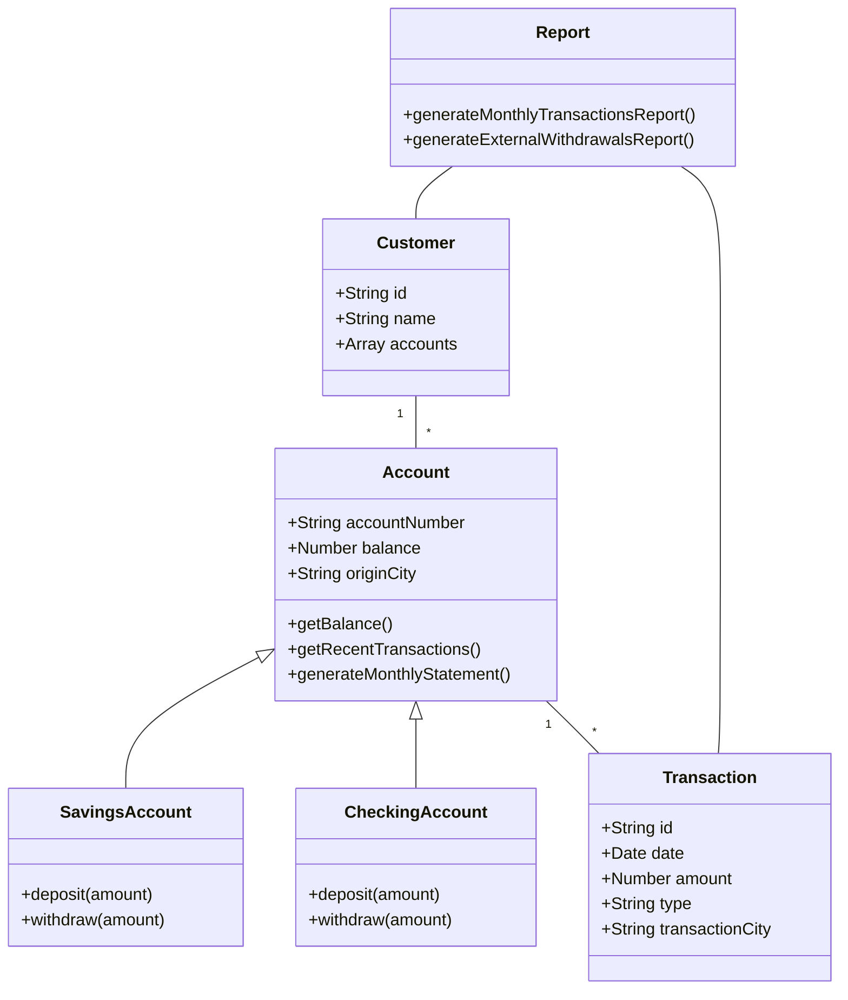

# SoftBlue Bank

SoftBlue Bank is a modern, scalable banking system built with Node.js, Express, MongoDB, and Next.js. It provides robust account management, real-time transaction processing, and comprehensive reporting features.

## Features

- Account Management (Savings and Checking accounts)
- Real-time transaction processing
- Concurrent operation handling
- Monthly statements generation
- Real-time reporting
- Secure authentication and authorization

## System Architecture

Below is a class diagram representing the core entities in the SoftBlue Bank system:



This diagram illustrates the relationships between the main entities in our system, including Account types, Customers, Transactions, and Reports.

## Tech Stack

- **Backend**: Node.js, Express.js, MongoDB, Redis
- **Frontend**: Next.js, React, Redux
- **Message Broker**: Apache Kafka
- **Containerization**: Docker
- **Orchestration**: Kubernetes
- **Logging and Monitoring**: ELK Stack (Elasticsearch, Logstash, Kibana)
- **Testing**: Jest
- **API Documentation**: Swagger/OpenAPI

## Getting Started

### Prerequisites

- Node.js (v14 or later)
- MongoDB
- Redis
- Docker and Docker Compose (for local development)

### Installation

1. Clone the repository:
   ```
   git clone https://github.com/andylopezr/bluesoft
   cd softblue-bank
   ```

2. Install dependencies:
   ```
   cd backend && npm install
   cd ../frontend && npm install
   ```

3. Set up environment variables:
   - Create `.env` files in both `backend` and `frontend` directories based on the provided `.env.example` files.

4. Start the development servers:
   ```
   # In the backend directory
   npm run dev

   # In the frontend directory
   npm run dev
   ```

5. Access the application at `http://localhost:3000`

## Project Structure

```
softblue-bank/
├── backend/
│   ├── src/
│   │   ├── controllers/
│   │   ├── kafka/
│   │   ├── models/
│   │   └── routes/
│   │   ├── services/
│   ├── tests/
│   └── package.json
├── frontend/
│   ├── src/
│   |   ├── app/
│   |   ├── components/
│   |   ├── store/
│   |   ├── services/
│   |   ├── styles/
│   └── package.json
├── docker-compose.yml
└── README.md
```

## API Documentation

API documentation is available via Swagger UI at `http://localhost:3000/api-docs` when running the development server.

## Testing

Run the test suite with:

```
npm test
```