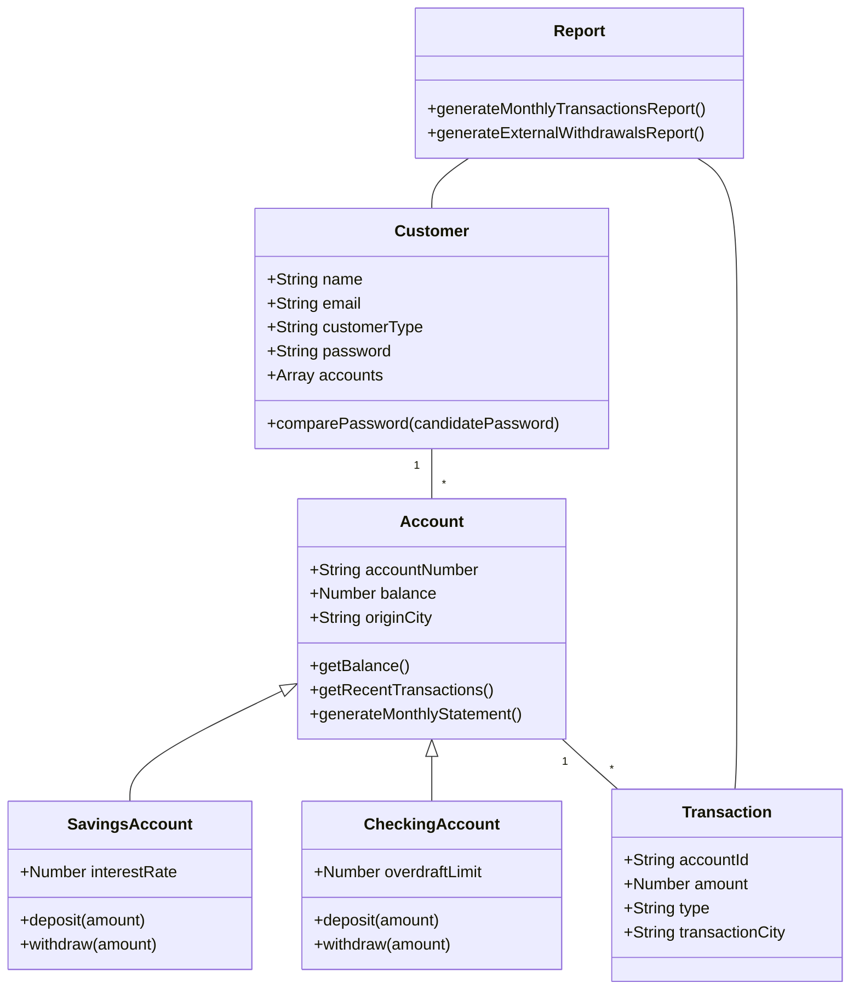

# Bluesoft Bank

Bluesoft Bank is a modern, scalable banking system built with Node.js, Express, MongoDB, and Next.js. It provides robust account management, real-time transaction processing, and comprehensive reporting features.

## Features

- Account Management (Savings and Checking accounts)
- Real-time transaction processing
- Concurrent operation handling
- Monthly statements generation
- Real-time reporting
- Secure authentication and authorization

## System Architecture

Below is a class diagram representing the core entities in the Bluesoft Bank system:



## Tech Stack

- **Backend**: Node.js, Express.js, MongoDB, Redis
- **Frontend**: Next.js, React, Redux
- **Message Broker**: Apache Kafka
- **Containerization**: Docker
- **Orchestration**: Kubernetes
- **Logging and Monitoring**: ELK Stack (Elasticsearch, Logstash, Kibana)
- **Testing**: Jest
- **API Documentation**: Swagger/OpenAPI

## Getting Started

### Prerequisites

- Node.js (v14 or later)
- MongoDB
- Redis
- Docker and Docker Compose (for local development)

### Installation

1. Clone the repository:
   ```
   git clone https://github.com/andylopezr/bluesoft
   cd bluesoft-bank
   ```

2. Install dependencies:
   ```
   cd backend && npm install
   cd ../frontend && npm install
   ```

3. Set up environment variables:
   - Create `.env` files in both `backend` and `frontend` directories based on the provided `.env.example` files.

4. Start the development servers:
   ```
   # In the backend directory
   npm run dev

   # In the frontend directory
   npm run dev
   ```

5. Access the application at `http://localhost:3000`

## Project Structure

```
bluesoft-bank/
├── backend/
│   ├── node_modules/
│   ├── src/
│   │   ├── middleware/
│   │   │   └── authMiddleware.ts
│   │   ├── models/
│   │   │   ├── Account.ts
│   │   │   ├── CheckingAccount.ts
│   │   │   ├── Customer.ts
│   │   │   ├── SavingsAccount.ts
│   │   │   └── Transaction.ts
│   │   ├── routes/
│   │   │   ├── accountRoutes.ts
│   │   │   ├── customerRoutes.ts
│   │   │   ├── reportingRoutes.ts
│   │   │   └── transactionRoutes.ts
│   │   ├── services/
│   │   │   ├── accountService.ts
│   │   │   ├── transactionService.ts
│   │   │   ├── app.ts
│   │   │   └── server.ts
│   ├── .env
│   ├── package-lock.json
│   ├── package.json
│   └── tsconfig.json
├── frontend/
│   ├── node_modules/
│   ├── public/
│   │   ├── hero.png
│   │   ├── next.svg
│   │   └── vercel.svg
│   ├── src/
│   │   ├── app/
│   │   │   ├── customers/
│   │   │   │   └── page.tsx
│   │   │   ├── dashboard/
│   │   │   │   ├── reports/
│   │   │   │   │   └── page.tsx
│   │   │   │   └── page.tsx
│   │   │   ├── favicon.ico
│   │   │   ├── globals.css
│   │   │   ├── layout.tsx
│   │   │   └── page.tsx
│   │   ├── components/
│   │   │   ├── AccountCreationModal.tsx
│   │   │   ├── AccountList.tsx
│   │   │   ├── CreateAccountButton.tsx
│   │   │   ├── CustomerForm.tsx
│   │   │   ├── CustomerList.tsx
│   │   │   ├── Layout.tsx
│   │   │   ├── LoginModal.tsx
│   │   │   ├── LogoutButton.tsx
│   │   │   ├── Navbar.tsx
│   │   │   ├── ReportGeneration.tsx
│   │   │   ├── ReportView.tsx
│   │   │   └── Transaction.tsx
│   │   └── utils/
│   │       └── formatCurrency.ts
│   ├── .env
│   ├── package-lock.json
│   └── package.json
├── docker-compose.yml
└── README.md
```

## Models

### Account
- Base model for all account types
- Fields: accountNumber, balance, originCity, customerId, accountType

### CheckingAccount
- Extends Account
- Additional field: overdraftLimit

### SavingsAccount
- Extends Account
- Additional field: interestRate

### Customer
- Fields: name, email, customerType, password, accounts
- Methods: comparePassword

### Transaction
- Fields: accountId, amount, type, transactionCity

## API Documentation

API documentation is available via Swagger UI at `http://localhost:5000/api-docs/` when running the development server.

## Testing

Run the test suite with:

```
npm test
```
